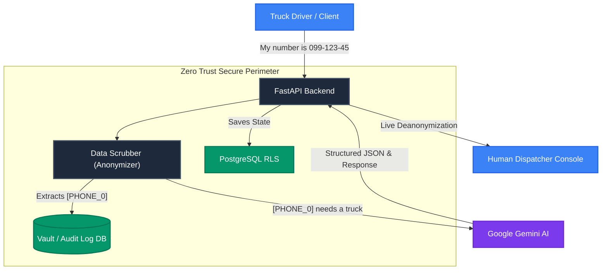

<div align="center">
  
</div>

# Zero Trust Dispatch

[](https://github.com/)
[](https://www.python.org/)
[](https://react.dev/)
[](https://opensource.org/licenses/MIT)

**Enterprise B2B logistics platform featuring AI-driven dispatch (Google Gemini), Data Scrubbing privacy barriers, and Human-in-the-Loop (HITL) capabilities.**

Zero Trust Dispatch automates cargo processing while strictly isolating sensitive client data from Large Language Models. It provides human dispatchers with a real-time, zero-trust control center to oversee automated negotiations and intercept complex logistical incidents seamlessly.

---

## 🏗 System Architecture & Data Privacy

Our core philosophy is **Zero Trust**. The LLM never sees raw personal data (PII). All sensitive information is masked before it leaves our secure perimeter and deanonymized on the fly for authorized dispatchers.



---

## 🌟 Core Features

| Feature | Description |
| --- | --- |
| 🤖 **AI Agent (Gemini)** | Autonomous communication with clients, extracting cargo details, ADR classes, and body types using strict Pydantic JSON schemas. |
| 🛡️ **Data Privacy (Scrubber)** | Built-in Data Scrubber masks personal data (phone numbers, emails) before LLM ingestion, preventing privacy leaks. |
| ✋ **Human-in-the-Loop (HITL)** | If the AI detects a high-stress scenario or complex ADR requirement, it triggers an alert and halts autonomy for human intervention. |
| 🔐 **Row-Level Security (RLS)** | Multi-tenant architecture. Dispatchers can only access data belonging to their specific organization at the database kernel level. |
| 📜 **Immutable Audit Trails** | All prompts, responses, and vault snapshots are immutably logged for B2B compliance and GDPR requirements. |
| ⚡ **Real-time Feedback** | Seamless, optimistic UI updates via TanStack Query and React. |

---

## 🚀 Getting Started (Docker Deployment)

The system is fully containerized into optimized multi-stage Docker images. For a production-ready server deployment, you only need Docker and Docker Compose.

### 1. Environment Preparation
Clone the repository and copy the reference environment configuration:
```bash
cp .env.example .env
```
Edit `.env` and provide your real secrets (API keys, DB passwords, JWT secrets, and SMTP credentials).

> [!WARNING]
> Never use default credentials in production. The system will automatically apply database migrations via Alembic on startup.

### 2. Build and Run
Execute the following command to deploy the system (Production-ready with Gunicorn workers and Nginx SPA-routing):
```bash
docker-compose -f docker-compose.prod.yml up --build -d
```

### 3. Access
After the containers start successfully:
- **Frontend (Dispatcher Console)**: `http://localhost` (or your server's IP/domain)
- **Backend (FastAPI)**: `http://localhost:8000`
- **Swagger Docs**: `http://localhost:8000/docs`

---

## 🛠 Technology Stack

### Backend
- **Framework**: FastAPI (Asynchronous)
- **Database**: PostgreSQL with Row-Level Security (RLS)
- **ORM**: SQLAlchemy (Async) + Alembic for migrations
- **AI Integration**: Google GenAI SDK (Gemini 3.1 Flash Lite)
- **Authentication**: JWT (PyJWT), Passlib (Bcrypt)

### Frontend
- **Framework**: React (Vite)
- **Styling**: TailwindCSS, Shadcn UI
- **State Management**: Zustand, TanStack Query
- **Localization**: i18next (English, Polish, Ukrainian)

### Infrastructure
- **Containers**: Docker, Docker Compose
- **Web Server**: Nginx (Reverse Proxy & SPA hosting)
- **Process Manager**: Gunicorn with Uvicorn workers

---

<div align="center">
  <i>Zero Trust Dispatch LLC — Securing the future of automated logistics.</i>
</div>
